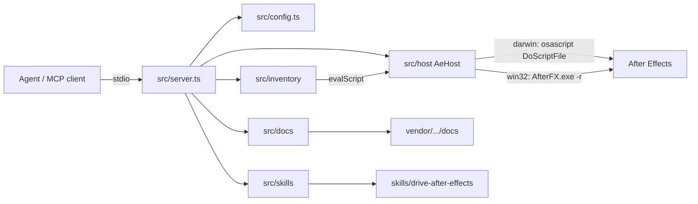

# Architecture

Living map of **LayerCake**: a stdio MCP server that drives a local Adobe After Effects install on macOS or Windows, inventories open projects, evaluates ExtendScript, and searches a vendored Scripting Guide.

Keep this file accurate. Update it when OpenSpec specs sync into `openspec/specs/` or when a change archives — see [Maintenance](#maintenance).

## System overview

Thin MCP tools compose over a single host bridge. Inventory and inspect tools use fixed ExtendScript serializers; one-off or mutating work goes through `ae_eval_script`.

## Layers

| Module           | Role                                                                                                         |
| ---------------- | ------------------------------------------------------------------------------------------------------------ |
| `src/index.ts`   | Wire config, host, docs corpus, product skill, stdio transport — orchestration only                          |
| `src/config.ts`  | Env loading and platform-aware `ConfigError` / `assertHostConfigured`; no AE I/O                             |
| `src/server.ts`  | Register MCP tools/resources; call host/inventory/docs/skills; return `textResult` / `isError`               |
| `src/host/`      | `AeHost` interface, `createAeHost` factory, macOS AppleScript + Windows CLI bridges, wrap/parse (`OK`/`ERR`) |
| `src/inventory/` | Read-only project inventories and deep inspect: `*-script.ts` + TS parse/filter/types                        |
| `src/docs/`      | Local corpus load/search; URIs use `ae://docs/...`                                                           |
| `src/skills/`    | Load packaged Agent Skill from `skills/`; URIs use `skill://...` (SEP-2640)                                  |

### Dependency direction

- `server` → `host` / `inventory` / `docs` / `skills` / `config`
- `inventory` → `host` (via `AeHost.evalScript`) and local parse/filter — not the reverse
- ExtendScript bodies live in `*-script.ts` (or shared helpers); TypeScript owns filtering, validation, and MCP shaping
- New host capabilities land on `AeHost` + platform implementations (`macos.ts` / `windows.ts`); tools stay thin wrappers

## Runtime flow

1. **Boot** — `loadConfig()` → `createAeHost(config)` (darwin / win32 / unavailable) → optional `loadDocsCorpus` / `loadProductSkill` → `createServer` → stdio.
2. **Host ops** — `ae_host_status` / `ae_open_project` call `AeHost` directly (macOS: AppleScript `open`; Windows: ExtendScript `app.open` via `-r`).
3. **Eval** — `ae_eval_script` validates source, wraps with JSON polyfill + result-file protocol, runs via AppleScript `DoScriptFile` (macOS) or `AfterFX.exe -r` (Windows), parses `OK`/`ERR`.
4. **Inventory / inspect** — tool builds or selects an ExtendScript string → `host.evalScript` → parse JSON → optional filter → MCP text result (inspect tools also enforce `AE_INSPECT_MAX_BYTES`).
5. **Docs** — `ae_docs_search` / `ae_docs_get` and `ae://docs/...` resources read the vendored corpus (no AE).
6. **Product skill** — when `skills/drive-after-effects` loads, serve `skill://…` resources + `skill://index.json`, set server `instructions`, and advertise `io.modelcontextprotocol/skills`.

## Capability map

Specs under `openspec/specs/<capability>/spec.md` are the behavior contracts. Code packages own the implementation.

| Capability                | MCP surface                                                                    | Primary code                                           |
| ------------------------- | ------------------------------------------------------------------------------ | ------------------------------------------------------ |
| `product-identity`        | npm/bin/MCP name `layercake`; product **LayerCake**                            | `package.json`, `src/server.ts`, `README.md`           |
| `ae-host`                 | `ae_host_status`, `ae_open_project`                                            | `src/host/`, `src/config.ts`                           |
| `extendscript-execution`  | `ae_eval_script`                                                               | `src/host/script-wrapper.ts`, `macos.ts`, `windows.ts` |
| `ae-comp-layer-inventory` | `ae_list_comps`                                                                | `src/inventory/list-comps*.ts`                         |
| `ae-project-sources`      | `ae_list_sources`                                                              | `src/inventory/list-sources*.ts`                       |
| `ae-project-folders`      | `ae_list_folders`                                                              | `src/inventory/list-folders*.ts`                       |
| `ae-scripting-docs`       | `ae_docs_search`, `ae_docs_get`, `ae://docs/...`                               | `src/docs/`                                            |
| `ae-layer-inspect`        | `ae_get_layer`                                                                 | `src/inventory/get-layer*.ts`, `inspect-*.ts`          |
| `ae-source-inspect`       | `ae_get_source`                                                                | `src/inventory/get-source*.ts`, `inspect-*.ts`         |
| `ae-product-skill`        | `skill://drive-after-effects/...`, `skill://index.json`, server `instructions` | `src/skills/`, `skills/drive-after-effects/`           |

Shared inventory helpers: `shared-script.ts`, `parse.ts`, `types.ts`, `filter.ts`, `inspect-limit.ts`.

Product skill files live at top-level `skills/` (shipped with the npm package). They are independent of contributor AgentSync under `.ai/src/`.

## Design constraints

- **Stable ids as handles** — `Item.id` (comps, footage, folders) and `Layer.id` (timeline) are distinct namespaces; join via `layer.source.id`.
- **Compact list, deep on demand** — `ae_list_*` stay small; property trees and interpret detail live in `ae_get_*` or `ae_eval_script`.
- **ES3 ExtendScript** — no modern JS in AE script bodies; `JSON` comes from the injected polyfill.
- **Contracts** — public `ae_*` names/schemas/JSON shapes, `AeHost`, and the eval result-file protocol change through OpenSpec when possible (prefer additive).
- **macOS + Windows host** — `darwin` uses AppleScript; `win32` uses `AfterFX.exe -r`; other platforms report host unavailable without attempting unsupported automation.
- **No dedicated mutation tools** — inventory/inspect/docs plus catchall `ae_eval_script`; mutations go through eval until write tools are deliberately added.
- **Agent guidance** — end-user product skill lives under `skills/`; contributor AgentSync guidance is edited under `.ai/src/` only, then `agentsync sync`.

## Related docs

- Agent-facing quickstart and tool tables: [`README.md`](README.md)
- Behavior requirements: [`openspec/specs/`](openspec/specs/)
- Architecture Decision Records: [`docs/adr/`](docs/adr/) (why we chose surprising / hard-to-reverse options)
- Coding placement / dependency rules: `.ai/src/rules/architecture.md` (synced to agent tools)

## Maintenance

`ARCHITECTURE.md` is a **first-class project contract**, not optional narrative.

Update it when any of the following change:

- Module boundaries or dependency direction
- New or removed MCP tools / resources
- Host bridge or eval protocol
- Inventory/inspect payload shape that agents rely on
- Capability list in `openspec/specs/`

**When to update (OpenSpec workflow):**

1. **`openspec-sync-specs` / `/opsx:sync`** — After merging delta specs into `openspec/specs/`, refresh the [Capability map](#capability-map) and any sections the new requirements change (layers, flows, constraints).
2. **`openspec-archive-change` / `/opsx:archive`** — Before finishing archive, reconcile this file against the **implemented** code (tools in `server.ts`, packages under `src/`). Sync may have already updated the map; archive is the final accuracy check.

If a change is code-only with no architectural impact, leave a one-line note in the archive summary that `ARCHITECTURE.md` was reviewed and unchanged — do not churn the file for cosmetics.
