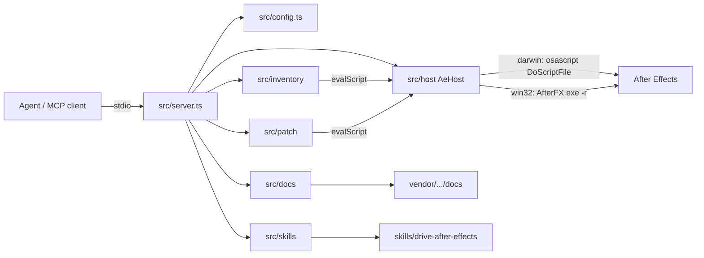

# Architecture

Living map of **LayerCake**: a stdio MCP server that drives a local Adobe After Effects install on macOS or Windows, inventories open projects, applies guarded typed patches, evaluates ExtendScript, and searches a vendored Scripting Guide.

Keep this file accurate. Update it when OpenSpec specs sync into `openspec/specs/` or when a change archives — see [Maintenance](#maintenance).

## System overview

Thin MCP tools compose over a single host bridge. Inventory, context, patch, save, and close use fixed ExtendScript serializers over `AeHost.evalScript`; one-off work still goes through `ae_eval_script`.

## Layers

| Module           | Role                                                                                                        |
| ---------------- | ----------------------------------------------------------------------------------------------------------- |
| `src/index.ts`   | Wire config, host, docs corpus, product skill, stdio transport — orchestration only                         |
| `src/config.ts`  | Env loading (`AE_*`, including `AE_ARTIFACT_DIR`) and platform-aware `ConfigError` / `assertHostConfigured` |
| `src/server.ts`  | Register MCP tools/resources; call host/inventory/patch/docs/skills; return `textResult` / `isError`        |
| `src/host/`      | `AeHost` interface, factory, macOS/Windows bridges, wrap/parse (`OK`/`ERR`), session open/close guards      |
| `src/inventory/` | Read-only inventories, inspect, and lean `ae_project_context` (fingerprint)                                 |
| `src/patch/`     | Typed apply-only patch schemas/scripts, broad-gate, `ae_save_project` helpers                               |
| `src/docs/`      | Local corpus load/search; URIs use `ae://docs/...`                                                          |
| `src/skills/`    | Load packaged Agent Skill from `skills/`; URIs use `skill://...` (SEP-2640)                                 |

### Dependency direction

- `server` → `host` / `inventory` / `patch` / `docs` / `skills` / `config`
- `inventory` → `host` (via `AeHost.evalScript`) and local parse/filter — not the reverse
- `patch` → `host` / `inventory` (context + fingerprint) — not the reverse
- ExtendScript bodies live in `*-script.ts` (or shared helpers); TypeScript owns filtering, validation, and MCP shaping
- Context / close / save / patch compose over `evalScript`; do not grow `AeHost` for those. Open gains a pre-open session guard, then delegates to `host.openProject`.

## Runtime flow

1. **Boot** — `loadConfig()` → `createAeHost(config)` (darwin / win32 / unavailable) → optional `loadDocsCorpus` / `loadProductSkill` → `createServer` → stdio.
2. **Session** — `ae_open_project` guards via context (same-path no-op; refuse different open project) then `AeHost.openProject`. `ae_close_project` closes via eval (`DO_NOT_SAVE_CHANGES` / `SAVE_CHANGES` only).
3. **Bind** — `ae_project_context` returns path / dirty / revision / fingerprint for frequent polling.
4. **Eval** — `ae_eval_script` validates source, wraps with JSON polyfill + result-file protocol, runs via AppleScript `DoScriptFile` (macOS) or `AfterFX.exe -r` (Windows), parses `OK`/`ERR`.
5. **Inventory / inspect** — tool builds or selects an ExtendScript string → `host.evalScript` → parse JSON → optional filter → MCP text result (inspect tools also enforce `AE_INSPECT_MAX_BYTES`).
6. **Patch / save** — `ae_patch_project` validates typed ops (`set_text_style`, `rename_layer`, `create_folder`, `move_project_item`, `delete_project_item`), guards path+fingerprint, applies in one undo group with post-condition-verified before/after evidence (no implicit save). Layer targets accept id or unique name (inspect parity). `ae_save_project` persists via `save_copy` (AE Save As) or `create_backup` (filesystem copy of the `.aep` only — not Collect Files) under `AE_ARTIFACT_DIR` / caller path.
7. **Docs** — `ae_docs_search` / `ae_docs_get` and `ae://docs/...` resources read the vendored corpus (no AE).
8. **Product skill** — when `skills/drive-after-effects` loads, serve `skill://…` resources + `skill://index.json`, set server `instructions`, and advertise `io.modelcontextprotocol/skills`.

## Capability map

Specs under `openspec/specs/<capability>/spec.md` are the behavior contracts. Code packages own the implementation.

| Capability                | MCP surface                                                                    | Primary code                                                                                      |
| ------------------------- | ------------------------------------------------------------------------------ | ------------------------------------------------------------------------------------------------- |
| `product-identity`        | npm/bin/MCP name `layercake`; product **LayerCake**                            | `package.json`, `src/server.ts`, `README.md`, `docs/`                                             |
| `ae-host`                 | `ae_host_status`, `ae_open_project`; `AE_ARTIFACT_DIR`                         | `src/host/`, `src/config.ts`                                                                      |
| `ae-project-session`      | `ae_close_project`; open refuse / same-path no-op                              | `src/host/session.ts`                                                                             |
| `ae-project-context`      | `ae_project_context`                                                           | `src/inventory/list-project-context*.ts`, `fingerprint.ts`                                        |
| `ae-project-patch`        | `ae_patch_project`                                                             | `src/patch/` (`schema`, `apply*`, `broad-gate`)                                                   |
| `ae-project-save`         | `ae_save_project`                                                              | `src/patch/save.ts`                                                                               |
| `extendscript-execution`  | `ae_eval_script`                                                               | `src/host/script-wrapper.ts`, `macos.ts`, `windows.ts`                                            |
| `ae-comp-layer-inventory` | `ae_list_comps`                                                                | `src/inventory/list-comps*.ts`                                                                    |
| `ae-project-sources`      | `ae_list_sources`                                                              | `src/inventory/list-sources*.ts`                                                                  |
| `ae-project-folders`      | `ae_list_folders`                                                              | `src/inventory/list-folders*.ts`                                                                  |
| `ae-project-summary`      | `ae_project_summary`                                                           | `src/inventory/list-project-summary*.ts`, `effect-origin.ts`, `first-party-effect-match-names.ts` |
| `ae-scripting-docs`       | `ae_docs_search`, `ae_docs_get`, `ae://docs/...`                               | `src/docs/`                                                                                       |
| `ae-layer-inspect`        | `ae_get_layer`                                                                 | `src/inventory/get-layer*.ts`, `inspect-*.ts`                                                     |
| `ae-source-inspect`       | `ae_get_source`                                                                | `src/inventory/get-source*.ts`, `inspect-*.ts`                                                    |
| `ae-product-skill`        | `skill://drive-after-effects/...`, `skill://index.json`, server `instructions` | `src/skills/`, `skills/drive-after-effects/`                                                      |

Shared inventory helpers: `shared-script.ts`, `resolve-script.ts` (id\|name resolve for inspect + patch), `layer-target-schema.ts` (shared layer id\|name Zod for inspect + patch), `parse.ts`, `types.ts`, `filter.ts`, `inspect-limit.ts`.

Product skill files live at top-level `skills/` (shipped with the npm package). They are independent of contributor AgentSync under `.ai/src/`.

## Design constraints

- **Stable ids as handles** — `Item.id` (comps, footage, folders) and `Layer.id` (timeline) are distinct namespaces; join via `layer.source.id`.
- **Compact list, deep on demand** — `ae_list_*` stay small; property trees and interpret detail live in `ae_get_*` or `ae_eval_script`. Context is the cheap bind poll; summary is the heavier health passport.
- **Guarded session** — open/close are session transitions; patch/save verify path+fingerprint and never open. Fingerprint = `rev:{n}\|dirty:{0\|1}\|path:{absolute\|unsaved}` (see [ADR 0002](docs/adr/0002-guarded-session-revision-fingerprint.md)). Assume 1:1 agent↔AE (no mutex).
- **Typed patch first** — prefer `ae_patch_project` for routine text-style, layer rename, and Project panel create/move/delete; `ae_eval_script` remains the escape hatch (bypasses guards). New ops use semantic verbs + op-specific fields; layer selectors are id-or-name with recoverable ambiguity errors; mutating targets report verified before/after (see [ADR 0003](docs/adr/0003-patch-targeting-and-post-conditions.md)).
- **Explicit save** — patch/context/inventory/eval must not persist; compose optional copy-first + patch + `ae_save_project` (`save_copy` / `create_backup` only in v1). `create_backup` copies the project file only and does not collect linked footage.
- **ES3 ExtendScript** — no modern JS in AE script bodies; `JSON` comes from the injected polyfill.
- **Contracts** — public `ae_*` names/schemas/JSON shapes, `AeHost`, and the eval result-file protocol change through OpenSpec when possible (prefer additive).
- **macOS + Windows host** — `darwin` uses AppleScript; `win32` uses `AfterFX.exe -r`; other platforms report host unavailable without attempting unsupported automation.
- **Agent guidance** — end-user product skill lives under `skills/`; contributor AgentSync guidance is edited under `.ai/src/` only, then `agentsync sync`.

## Related docs

- Operator showcase/quickstart: [`README.md`](README.md); reference depth in [`docs/setup.md`](docs/setup.md), [`docs/mcp-tools.md`](docs/mcp-tools.md), [`docs/troubleshooting.md`](docs/troubleshooting.md), [`docs/scripting-guide.md`](docs/scripting-guide.md)
- Behavior requirements: [`openspec/specs/`](openspec/specs/)
- Architecture Decision Records: [`docs/adr/`](docs/adr/) (why we chose surprising / hard-to-reverse options)
- Coding placement / dependency rules: `.ai/src/rules/architecture.md` (synced to agent tools)

## Maintenance

`ARCHITECTURE.md` is a **first-class project contract**, not optional narrative.

Update it when any of the following change:

- Module boundaries or dependency direction
- New or removed MCP tools / resources
- Host bridge or eval protocol
- Inventory/inspect payload shape that agents rely on
- Capability list in `openspec/specs/`

**When to update (OpenSpec workflow):**

1. **`openspec-sync-specs` / `/opsx:sync`** — After merging delta specs into `openspec/specs/`, refresh the [Capability map](#capability-map) and any sections the new requirements change (layers, flows, constraints).
2. **`openspec-archive-change` / `/opsx:archive`** — Before finishing archive, reconcile this file against the **implemented** code (tools in `server.ts`, packages under `src/`). Sync may have already updated the map; archive is the final accuracy check.

If a change is code-only with no architectural impact, leave a one-line note in the archive summary that `ARCHITECTURE.md` was reviewed and unchanged — do not churn the file for cosmetics.
